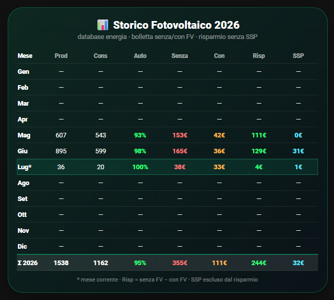

# ☀️ HA Energy Suite

Benvenuto!

HA Energy Suite è una raccolta di card per Home Assistant dedicate agli impianti fotovoltaici.

L'obiettivo è semplice: condividere le card che utilizzo ogni giorno sul mio impianto, permettendo a chiunque di installarle in pochi minuti senza configurazioni complicate.



Niente framework.
Niente installazioni complesse.
Solo card utili, curate e facili da adattare al proprio impianto.

---

# 🚧 Stato del progetto

**Versione attuale:** v0.1.0 Alpha

Questa è la prima versione pubblica.

Le card sono perfettamente funzionanti sul mio impianto, ma il progetto non è ancora stato testato su installazioni diverse.

Se decidi di provarle, il tuo feedback sarà fondamentale per migliorare il progetto.

---

# 📦 Requisiti

A seconda della card scelta potrebbero essere necessari:

- Home Assistant
- Dashboard Energia configurata
- custom:button-card
- SQL Integration

Ogni card riporta chiaramente i propri requisiti.

---

# 🚀 Installazione

L'installazione è volutamente semplice.

1. Scarica la card desiderata dalla cartella **cards**.
2. Se richiesto, copia il relativo file SQL nella cartella:

```
/config/sql/
```

3. Aggiungi il file SQL al tuo `configuration.yaml`.

Esempio:

```yaml
sql: !include sql/monthly-report-sql.yaml
```

4. Riavvia Home Assistant.
5. Segui le istruzioni presenti nel file SQL (ad esempio sostituendo i metadata_id).
6. Copia la card nella tua dashboard Lovelace.

Fine.

---

# 📁 Struttura del repository

```
HA-Energy-Suite
│
├── cards/
├── sql/
├── docs/
├── screenshots/
├── README.md
├── CHANGELOG.md
├── ROADMAP.md
├── CONTRIBUTING.md
├── LICENSE
└── BRAND.md
```

---

# 📋 Card disponibili

## Monthly Report

Storico mensile dell'impianto fotovoltaico con:

- Produzione
- Consumo
- Autosufficienza
- Spesa senza fotovoltaico
- Spesa con fotovoltaico
- Risparmio
- Valore SSP

Altre card arriveranno nelle prossime versioni.

---

# ❤️ Come puoi aiutare

Il progetto è appena nato.

Se provi una card mi farebbe davvero piacere sapere:

- Se ha funzionato.
- Quale inverter utilizzi.
- Se hai dovuto modificare qualcosa.
- Se trovi bug o hai suggerimenti.

Puoi aprire una **Issue** oppure una **Pull Request**.

Ogni contributo è benvenuto.

---

# 💡 Filosofia del progetto

HA Energy Suite nasce con un'idea molto semplice:

> Condividere card belle, utili e facili da installare.

Non vuole sostituire Home Assistant.

Non vuole essere un framework.

Non vuole complicare la configurazione.

Vuole semplicemente offrire card che chiunque possa scaricare, configurare e utilizzare in pochi minuti.

---

# 📄 Licenza

Questo progetto è distribuito con licenza **MIT**.

Se ti piace il progetto, lascia una ⭐ su GitHub!