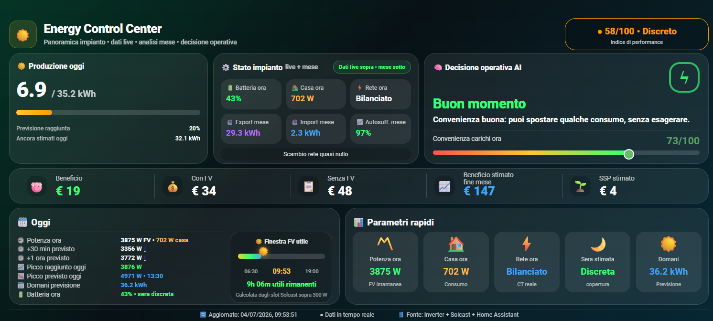

# ⚡ Energy Control Center

<p align="center">
  
</p>

## Panoramica

**Energy Control Center** è una dashboard completa per Home Assistant progettata per monitorare in tempo reale il proprio impianto fotovoltaico.

In un'unica schermata riunisce tutte le informazioni principali sull'impianto, permettendo di controllare produzione, consumi, batteria, rete elettrica, previsioni di produzione e benefici economici senza dover passare da una dashboard all'altra.

La dashboard utilizza i sensori SQL presenti nella cartella **`/sql`** del repository.

---

# ✨ Funzionalità

La dashboard visualizza:

- ☀️ Produzione fotovoltaica in tempo reale
- 📈 Confronto tra produzione reale e previsione Solcast
- 🔋 Stato di carica della batteria
- 🏠 Consumo istantaneo dell'abitazione
- ⚡ Import / Export della rete
- 📊 Autosufficienza energetica
- 💰 Beneficio economico del mese
- 🔵 Stima del ricavo da Scambio sul Posto (SSP)
- 📅 Analisi mensile dell'impianto
- 📉 Indice di performance
- ⏱️ Finestra utile di produzione fotovoltaica
- 💡 Suggerimenti automatici per ottimizzare i consumi
- 🔄 Aggiornamento automatico in tempo reale

---

# 📋 Requisiti

Prima dell'installazione assicurati di avere:

- Home Assistant
- `custom:button-card`
- Integrazione Solcast configurata
- Sensori SQL installati seguendo la guida presente nella cartella:

```text
/sql/
```

---

# 🚀 Installazione

## 1. Installa i sensori SQL

Prima di utilizzare questa dashboard è necessario installare i sensori SQL.

Apri la cartella:

```text
/sql/
```

e segui il relativo **README.md**.

Questa operazione deve essere eseguita una sola volta.

---

## 2. Riavvia Home Assistant

Dopo aver installato i sensori SQL riavvia Home Assistant.

---

## 3. Configura Solcast

Questa dashboard utilizza le previsioni generate dall'integrazione ufficiale **Solcast**.

Una volta configurata l'integrazione non sarà necessario modificare i relativi sensori.

---

## 4. Aggiungi la dashboard

Apri la dashboard nella quale desideri inserire la card.

Seleziona:

**Modifica Dashboard → Aggiungi Card → Manuale**

Copia e incolla il contenuto del file:

```text
energy-control-center.yaml
```

---

## 5. Personalizza la card

La dashboard è già pronta all'uso.

È sufficiente modificare:

### I sensori del tuo inverter

Cerca tutti i sensori che iniziano con:

```text
sensor.inverter_
```

e sostituiscili con gli Entity ID del tuo impianto.

I principali sensori sono:

| Sensore | Descrizione |
|----------|-------------|
| `sensor.inverter_pv_power` | Produzione fotovoltaica istantanea |
| `sensor.inverter_load_l1_power` | Consumo istantaneo della casa |
| `sensor.inverter_internal_ct1_power` | Import / Export della rete |
| `sensor.inverter_battery` | Stato di carica della batteria |
| `sensor.inverter_today_production` | Produzione giornaliera |
| `sensor.inverter_today_peak_power` | Picco di produzione |
| `sensor.inverter_today_energy_import` | Energia acquistata oggi |

Eventuali altri sensori con prefisso:

```text
sensor.inverter_
```

dovranno essere sostituiti nello stesso modo.

---

### Valori economici

All'inizio del file troverai queste righe:

```javascript
const costoKwh = 0.25;
const quotaFissaMese = 18.00;
const sspKwh = 0.15;
```

Modifica solamente questi valori inserendo quelli del tuo contratto di fornitura.

- **costoKwh** → costo finale di 1 kWh acquistato.
- **quotaFissaMese** → quota fissa media mensile della bolletta.
- **sspKwh** → valore medio riconosciuto per ogni kWh immesso tramite Scambio sul Posto.

Una volta completate queste modifiche, salva la dashboard.

---

# 📝 Note

- Tutti i dati storici vengono letti dalle Long-Term Statistics della Dashboard Energia.
- Le previsioni di produzione utilizzano l'integrazione ufficiale Solcast.
- I calcoli economici utilizzano i valori configurati all'inizio del file.
- I dati economici dipendono dai sensori SQL installati nella cartella `/sql`.

---

# 💡 Consigli

Per sfruttare al meglio i dati raccolti, puoi installare anche:

- 📈 Monthly Report
- 📊 Annual Report

Entrambe le card utilizzano gli stessi sensori SQL e si integrano perfettamente con Energy Control Center.

---

# ❤️ Supporto

Hai trovato un bug o desideri proporre un miglioramento?

Puoi:

- Aprire una **GitHub Issue**
- Inviare una **Pull Request**

Se questa dashboard ti è stata utile, lascia una ⭐ al repository.

Ogni contributo aiuta il progetto a crescere.

---

# 📄 Licenza

Distribuito con licenza **MIT**.